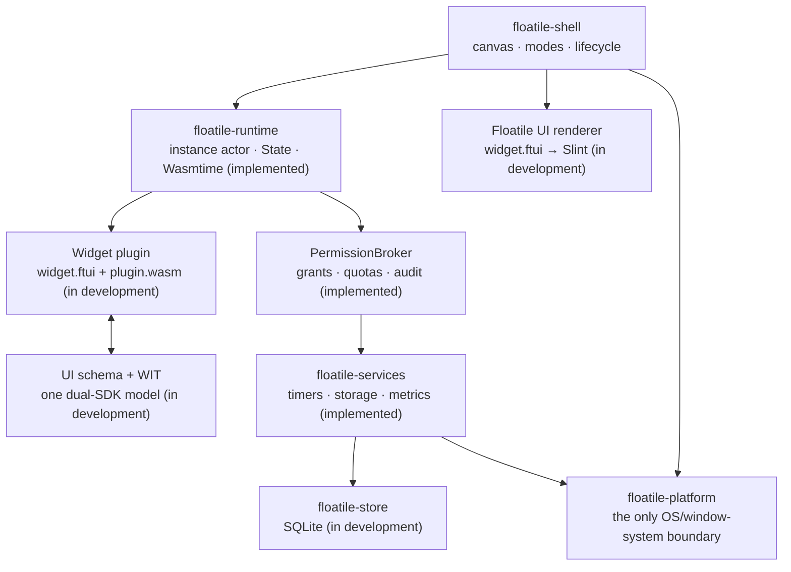

<div align="center">

# Floatile

**Lightweight, composable, and controlled widgets for your desktop.**

A cross-platform floating desktop widget host for Windows, macOS, and Linux, built with Rust, Slint,
and the WebAssembly Component Model.

[](https://github.com/powercess/floatile/actions/workflows/ci.yml)
[](rust-toolchain.toml)
[](#project-status)
[](#platform-support)
[](https://github.com/powercess/floatile/stargazers)

**English** · [简体中文](README.md)

[Quick start](#quick-start) · [Feature vision](#feature-vision) · [Architecture](#architecture) · [Roadmap](#roadmap) · [Contributing](#contributing)

</div>

> [!IMPORTANT]
> Floatile is in the **P0 technical feasibility stage** and is not a stable application for everyday use.
> Items marked 🧪 or 🗺️ below are under development or planned; they are not claims of completed support.
> P0 exists to validate the cross-platform window and sandboxed plugin paths with reproducible evidence.

## Why Floatile?

Floatile aims to provide a lightweight, persistent desktop canvas for clocks, system monitors, timers,
developer tools, and third-party widgets—without allowing plugins to bypass the host and access files,
the network, commands, or native windows directly.

- **Desktop-native presence:** transparent, borderless, always-on-top windows with explicit degradation.
- **Separate edit and display modes:** edit mode owns movement, resizing, and settings; show mode hides host UI
  and enables click-through where the platform supports it.
- **Untrusted by default:** plugins are planned to run as WebAssembly components, with every host capability
  mediated by a deny-by-default `PermissionBroker`.
- **Cross-platform without pretending every platform is identical:** runtime capability probes drive behavior,
  particularly on Wayland.
- **Designed for plugin authors and AI agents:** Rust and TypeScript share one `State / View / Event / Context`
  model; generated contracts and the CLI hide Wasmtime, Slint, and packaging internals.

## Project status

Legend: ✅ basic implementation exists · 🧪 in development or awaiting complete validation · 🗺️ planned

| Capability | Status | Current reality |
|---|:---:|---|
| Rust workspace and core domain types | ✅ | Nine host/SDK crates, one WASM clock fixture, a pinned toolchain, and baseline CI |
| Native reference clock | ✅ | Runnable Slint clock updated once per second |
| Transparent, borderless, always-on-top window | 🧪 | Runtime evidence exists for Windows, Linux X11, and macOS; X11 explicitly degrades to opaque without a compositor, while Wayland remains unverified |
| Window dragging | 🧪 | Runtime evidence exists for Windows, Linux Xvfb, and VMware Xfce/Xorg; macOS/Wayland interaction remains unverified |
| Capability probing and degradation | 🧪 | Native Windows, X11 compositor/SHAPE/EWMH/RandR, and macOS window/display/metrics/hotkey probes are implemented; Wayland has explicit protocol degradation |
| Edit/show modes, resize, and multi-display layout | 🧪 | Edit/show, click-through coordination, dragging, and resizing are implemented on the Windows and Linux X11 paths; platform-neutral primary-display fallback/original-display recovery is implemented, while Canvas integration and real multi-display/DPI/hot-plug evidence remain |
| SQLite layout persistence | 🧪 | Layout schema v2, CRUD, v1 upgrade/rollback, and reopen persistence tests are implemented; the shell now wires startup save/restore and display-change re-apply (verified on Xvfb+Openbox); real multi-display/hot-plug validation and multi-instance orchestration remain |
| Unified-UI WASM widgets | 🧪 | ADR-0001 defines `widget.ftui + plugin.wasm`, State Patch, and serialized instance actors; WIT/bindings/`clock.wasm` migrated to the unified lifecycle and UI State contract and pass `wasm-tools validate`; `floatile-ui-schema`, `floatile-runtime` (Wasmtime actor + State Patch), and `floatile-services` (Broker) implemented with clock integration tests passing; CLI, dual-SDK, renderer spike, and contract tests remain |
| Permission Broker and audit trail | 🧪 | deny-by-default decisions, scopes/quotas, redacted audit (target `floatile::audit`), and clock/log/timer/storage/metrics/theme services implemented with tests; hostile-plugin fixtures and SQLite audit persistence remain |
| Plugin SDK and packaging CLI | 🧪 | `.floatile` package validation core (zip/paths/zip-bomb/manifest/UI IR/WASM world) implemented; new/dev/build commands remain |
| Cross-platform and performance acceptance | 🗺️ | Numbers in the acceptance docs are targets, not measured results |

See the authoritative [requirements baseline](docs/product/requirements.md) and
[P0 acceptance criteria](docs/architecture/p0-acceptance.md) for scope and evidence.

## Feature vision

### Desktop canvas

- Transparent, borderless, always-on-top widget windows (🧪)
- Edit/show modes and capability-aware click-through (🗺️)
- Dragging (🧪), resizing, z-order, and logical-pixel layout (🗺️)
- Multi-display, DPI, hot-plug recovery, and explicit degradation records (🗺️)
- Built-in reference clock (✅) and a future plugin-based clock example (🗺️)

### Secure plugin system

- Unified Floatile UI IR plus the WebAssembly Component Model and versioned WIT contracts (🗺️)
- Wasmtime fuel, memory, call-rate, and lifecycle budgets (🗺️)
- A deny-by-default `PermissionBroker` for every host capability (🗺️)
- Scoped and audited storage, timer, metrics, and logging services (🗺️)
- Untrusted-input validation for manifests, archives, UI IR, WASM, assets, configuration, State Patch, and WIT arguments (🗺️)

### Plugin developer experience

- Rust and TypeScript SDKs with the same `State / View / Event / Context` and component semantics (🗺️)
- Build-time JSX/Rust View compilation to `widget.ftui`; authors do not edit WIT, generated manifests, or Slint (🗺️)
- `floatile new/dev/check/test/preview/build/inspect` plus stable `--json` agent interfaces (🗺️)
- Native, Rust-WASM, and TypeScript-WASM reference clocks (native ✅, plugin versions 🗺️)

> A plugin marketplace, signing and updates, custom theme systems/editors, credential storage, network Broker, inter-plugin
> communication, and sidecars are outside P0 and remain candidates for later phases.

## Quick start

### Prerequisites

- [`rustup`](https://rustup.rs/)
- A working desktop graphics environment
- On Linux, the system dependencies required by the Slint/winit backend; transparency also depends on the
  display protocol and compositor

The repository pins Rust 1.97.1 and the `wasm32-wasip2` target in `rust-toolchain.toml`.

### Run the current prototype

```bash
git clone https://github.com/powercess/floatile.git
cd floatile
rustup show
cargo run -p floatile-shell --locked
```

The current application opens a reference clock window. Transparency, always-on-top behavior, and dragging
may degrade depending on the environment; logs report the detected capability set. The clock currently shows
UTC-derived wall time and has not yet integrated local time zones.

For more detailed logs:

```bash
RUST_LOG=debug cargo run -p floatile-shell --locked
```

### Local checks

```bash
cargo fmt --all -- --check
cargo check --workspace --all-targets --locked
cargo clippy --workspace --all-targets --locked -- -D warnings
cargo test --workspace --all-targets --locked
```

## Architecture



Plugins receive no native host handles, and every future host capability must pass through the Broker. The
Slint main thread only runs the event loop; background I/O and untrusted WASM are planned for Tokio/Wasmtime,
with bounded messages posted back to the UI.

### Technology stack

| Layer | Technology | Status/purpose |
|---|---|---|
| Language/toolchain | Rust 2024 · Rust 1.97.1 | ✅ pinned patch toolchain and lockfile |
| UI/windowing | Slint 1.17 · winit 0.30 | 🧪 reference clock and base window attributes |
| Plugin UI | Floatile UI IR v1 | 🧪 IR types, component registry, and State/Event schema validation implemented; renderer/CLI wiring pending |
| Plugin ABI | WIT · WASM Component Model · `wasm32-wasip2` | 🧪 ADR-0001 target contract and both bindings migrated and pass `wasm-tools validate` |
| Plugin runtime | Wasmtime | 🗺️ async component calls, fuel, and resource limits |
| Async runtime | Tokio | 🗺️ background I/O without blocking the Slint thread |
| Persistence | SQLite · bundled rusqlite | 🧪 layout schema v2 and recovery metadata; plugin KV and audit records 🗺️ |
| Data/errors | serde · serde_json · thiserror | ✅/🧪 introduced as each contract lands |
| Observability | tracing · tracing-subscriber | ✅ base logs; structured audit 🗺️ |
| Quality gates | rustfmt · Clippy · Cargo test · cargo-deny · GitHub Actions | ✅ three-OS CI configuration |

See the [technology stack document](docs/architecture/technology-stack.md) for version and selection policies.

## Workspace

| Crate | Responsibility | Stage |
|---|---|:---:|
| `floatile-core` | Pure domain models, IDs, geometry, and permission types | 🧪 |
| `floatile-platform` | Capability probes and all OS/window-system differences | 🧪 |
| `floatile-shell` | Desktop host, canvas, modes, and application composition | 🧪 |
| `floatile-plugin-api` | WIT host bindings and contract types | 🧪 |
| `floatile-ui-schema` | Guest-safe UI IR, components, and State/Event schema source | 🧪 |
| `floatile-runtime` | Instance actors, State, budgets, and Wasmtime execution | 🧪 |
| `floatile-services` | Broker-mediated host services | 🧪 |
| `floatile-store` | SQLite, migrations, and transactions | 🧪 |
| `floatile-sdk` | WASI guest SDK + author layer (Widget/View/Context/derive State) | 🧪 |
| `floatile-cli` | Plugin package validation, builds, and development tools | 🧪 |

Crate dependency rules are security and portability boundaries, not suggestions. See
[Workspace and crate boundaries](docs/architecture/workspace-and-crates.md).

## Platform support

| Platform | Target | Current evidence |
|---|---|---|
| Windows | Transparency, always-on-top, click-through, edit/show modes | Runtime evidence recorded for borderless transparency, topmost state, click-through, edit/show, dragging, and resizing |
| macOS | Transparency, always-on-top, click-through, edit/show modes | Probe, borderless topmost window, and layout persistence/recovery verified on macOS 15.7.5; click-through/drag/resize interaction remains |
| Linux X11 | Compositor-dependent transparency and WM capabilities | Xvfb/Openbox/picom and VMware Xfce/Xorg evidence recorded; physical multi-display/DPI/hot-plug remains unverified |
| Linux Wayland | Capability tiers with explicit degradation | Explicit protocol degradation verified under headless weston; real desktop sessions remain unverified |

“Target” is not a compatibility claim. Runtime evidence belongs in the
[platform capability matrix](docs/platform-matrix/platform-matrix.md).

## Roadmap

- **S1 · Floating-window baseline (in progress):** reference clock, transparent/borderless/AOT window,
  dragging, and real platform probes
- **S2 · Desktop interaction (in progress):** edit/show, click-through, resizing, and Linux X11 monitor enumeration; real multi-display/DPI evidence remains
- **S3 · Layout persistence (in progress):** monitor-local recovery, SQLite v2, shell startup save/restore, and display-change re-apply are implemented; real multi-display/hot-plug validation and multi-instance orchestration remain
- **S4 · Plugin contract (architecture complete, contract migrated):** ADR-0001, unified UI, WIT, manifest, and dual-SDK architecture; WIT/bindings/clock migrated to the unified lifecycle and pass `wasm-tools validate`
- **S5 · Sandboxed runtime (in progress):** UI schema, runtime actor, State Patch, Wasmtime, and Broker implemented with clock integration tests passing; CLI packaging, Rust SDK author loop, and hostile-plugin tests remain
- **P0 acceptance (planned):** Windows/macOS/X11/Wayland evidence, performance measurements, risk review,
  and licensing ADR

The roadmap will change when evidence warrants it. Accurately documenting and degrading an infeasible platform
capability is also a valid P0 outcome.

## Contributing

Floatile welcomes issue reports, design discussion, documentation improvements, and small, complete changes.
The architecture and licensing model are still converging, so please read these before writing code:

1. [Contributing guide](CONTRIBUTING.md) — branches, commits, tests, and pull requests
2. [Requirements baseline](docs/product/requirements.md) — P0 scope, IDs, and non-goals
3. [Documentation index](docs/README.md) — authoritative sources for each domain
4. [Development workflow](docs/development/workflow.md) — local gates and evidence requirements

Normal work starts from the latest `dev` on a single-purpose branch and returns through a PR to `dev`.
Security, WIT, platform, persistence, and crate-boundary changes require their coupled contracts, tests,
and architecture documentation.

## Documentation

- [P0 technical design](docs/architecture/p0-design.md)
- [P0 acceptance criteria](docs/architecture/p0-acceptance.md)
- [Technology stack and version policy](docs/architecture/technology-stack.md)
- [Plugin permission model](docs/security/permission-model.md)
- [Manifest v1](docs/plugin-sdk/manifest-v1.md)
- [WIT API v1](docs/plugin-sdk/wit-api-v1.md)
- [Floatile UI IR v1](docs/plugin-sdk/ui-ir-v1.md)
- [Plugin system architecture](docs/plugin-sdk/plugin-system-architecture.md)
- [Rust/TypeScript SDK and developer experience](docs/plugin-sdk/sdk-developer-experience.md)
- [ADR-0001: unified plugin UI](docs/architecture/decisions/0001-unified-plugin-ui.md)
- [Architecture risk register](docs/architecture/risks.md)

## Security

The plugin security boundary is still being designed and implemented. Do not run untrusted WASM, UI IR,
assets, or plugin packages. P0/MVP plugins do not accept third-party `.slint`. Until a dedicated security contact exists, avoid public disclosure of exploitable details
and contact the repository owner privately.

## License and distribution

> [!WARNING]
> The workspace is currently marked `PROPRIETARY`, and Slint distribution licensing still requires legal and
> product decisions. Floatile is **not currently licensed for public open-source distribution**. Do not publish
> binaries, the SDK, or `.floatile` packages, and do not add an open-source `LICENSE`, until the
> [licensing analysis](docs/architecture/licensing.md) is complete and an ADR is accepted.

---

<div align="center">

If the direction of Floatile interests you, leave a ⭐ and follow the P0 validation work.

</div>
