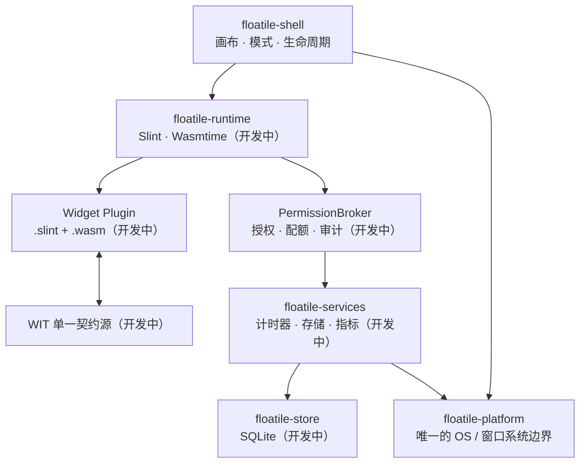

<div align="center">

# Floatile

**把轻量、可组合、受控的 Widget 带到你的桌面。**

一个面向 Windows、macOS 与 Linux 的跨平台桌面浮动组件宿主，使用 Rust、Slint 与
WASM Component Model 构建。

[](https://github.com/powercess/floatile/actions/workflows/ci.yml)
[](rust-toolchain.toml)
[](#项目状态)
[](#平台支持)
[](https://github.com/powercess/floatile/stargazers)

[English](README.en.md) · **简体中文**

[快速开始](#快速开始) · [功能蓝图](#功能蓝图) · [技术架构](#技术架构) · [路线图](#路线图) · [参与贡献](#参与贡献)

</div>

> [!IMPORTANT]
> Floatile 当前处于 **P0 技术可行性验证阶段**，尚未发布可供日常使用的稳定版本。
> 本文中的 🧪 和 🗺️ 项目代表开发中或规划能力，不是已完成承诺。现阶段的目标是用可复现证据
> 验证跨平台窗口与沙箱插件链路，并如实暴露平台限制。

## 为什么是 Floatile？

Floatile 希望提供一块始终在桌面上的轻量画布：时钟、系统状态、倒计时、开发工具或第三方
Widget 可以自由布局，却不能绕过宿主直接读取文件、访问网络、执行命令或控制原生窗口。

- **像桌面的一部分**：透明、无边框、置顶的浮动窗口，并为平台不支持的能力提供明确降级。
- **编辑与展示分离**：编辑模式负责拖拽、缩放与配置；展示模式隐藏宿主控件并按能力启用点击穿透。
- **插件默认不可信**：计划以 WASM Component Model 隔离插件，所有宿主能力统一经过
  deny-by-default `PermissionBroker`。
- **跨平台但不假装一致**：能力由运行时探测驱动；尤其在 Wayland 下会报告限制，而不是静默失败。
- **为插件作者而设计**：WIT 是 host/guest 接口的唯一来源，配套 SDK、CLI、manifest 校验和开发示例。

## 项目状态

状态图例：✅ 已有基础实现 · 🧪 正在开发/等待完整验证 · 🗺️ 规划中

| 能力 | 状态 | 当前说明 |
|---|:---:|---|
| Rust workspace 与领域基础类型 | ✅ | 九个 crate 的分层骨架、固定工具链与基础 CI 已建立 |
| 原生参考时钟 | ✅ | 可运行的 Slint 时钟，每秒更新，用作窗口与性能基线 |
| 透明、无边框、置顶窗口 | 🧪 | Windows、Linux X11 与 macOS 已有运行证据；X11 无合成器时显式降级为不透明，Wayland 待实测 |
| 窗口拖拽 | 🧪 | Windows、Linux Xvfb 与 VMware Xfce/Xorg 已运行验证；macOS/Wayland 待交互实测 |
| 平台能力探测与降级 | 🧪 | Windows 原生探测、X11 compositor/SHAPE/EWMH/RandR 实探测与 macOS 探测（点击穿透/置顶/显示器/指标/热键）已落地；Wayland 仅有显式协议降级 |
| 编辑/展示模式、缩放与多屏布局 | 🧪 | Edit/Show、点击穿透联动和拖拽缩放已在 Windows 与 Linux X11 子路径落地；平台无关的主屏降级/原屏回归已实现，Canvas 接入及真实多屏/DPI/热插拔仍待验证 |
| SQLite 布局持久化 | 🧪 | layout schema v2、CRUD、v1 升级/回滚及重启恢复测试已落地；shell 已接入启动保存/恢复与显示器变化重恢复（Xvfb+Openbox 实测）；真实多屏/热插拔实机验证与多实例编排待做 |
| `.slint + .wasm` Widget | 🧪 | WIT v1 契约、SDK guest 绑定、host async 绑定与 `clock.wasm` 组件构建已落地（wasm-tools validate 通过）；wasmtime 运行时加载执行待实现 |
| Permission Broker 与审计 | 🗺️ | 默认零权限、scope/配额、参数脱敏与恶意插件测试尚未实现 |
| 插件 SDK 与打包 CLI | 🗺️ | 计划提供 validate/build/dev、包路径和大小安全校验 |
| 三平台与性能验收 | 🗺️ | 指标仅为目标值，目前不代表已达到或已验证 |

权威进度与验收范围请查看[需求基线](docs/product/requirements.md)和
[P0 验收标准](docs/architecture/p0-acceptance.md)。

## 功能蓝图

### 桌面画布

- 透明、无边框、Always-on-top 的 Widget 窗口（🧪）
- Edit / Show 双模式与按平台能力启用的点击穿透（🧪 Windows 与 Linux X11 已实测，其他平台按能力降级）
- 拖拽（🧪）、缩放（🧪）、层级管理和逻辑像素布局（🗺️）
- 多显示器、DPI 缩放、热插拔恢复和显式降级记录（🧪 逻辑与持久化已接入 shell，Xvfb 实测；真实多屏实机验证待做）
- 内建参考时钟（✅）与后续插件化时钟示例（🗺️）

### 安全插件系统

- WASM Component Model + 版本化 WIT 契约（🗺️）
- Wasmtime fuel、内存上限、调用频率与生命周期预算（🗺️）
- 所有宿主能力必须通过 `PermissionBroker`，默认拒绝（🗺️）
- 存储、计时器、指标与日志能力的 scope、配额和脱敏审计（🗺️）
- 对 manifest、归档路径、Slint、WASM、配置与 WIT 参数进行不可信输入校验（🗺️）

### 插件开发体验

- 面向 `wasm32-wasip2` 的 Rust SDK 和同源 guest bindings（🗺️）
- `.floatile` 包的 manifest、UI、logic 与 assets 约定（🗺️）
- `floatile validate`、`floatile build` 和 `floatile dev` 工作流（🗺️）
- 原生时钟与 WASM 时钟参考实现（前者 ✅，后者 🗺️）

> 插件市场、签名/自动更新、主题系统、凭证托管、网络 Broker、跨插件通信和 Sidecar 不在 P0
> 范围内；它们属于后续阶段的候选能力。

## 快速开始

### 前置条件

- 已安装 [`rustup`](https://rustup.rs/)
- 可用的桌面图形环境
- Linux 需要满足 Slint/winit 后端的系统依赖；透明效果还取决于显示协议与合成器

仓库通过 `rust-toolchain.toml` 自动选择 Rust 1.97.1，并安装 `wasm32-wasip2` target。

### 运行当前原型

```bash
git clone https://github.com/powercess/floatile.git
cd floatile
rustup show
cargo run -p floatile-shell --locked
```

当前程序会启动一个参考时钟浮窗。平台能力尚在开发中，因此窗口透明、置顶或拖拽行为可能按环境
降级；日志会显示探测结果。时钟目前按 UTC 秒数展示，尚未接入本地时区。

查看更详细日志：

```bash
RUST_LOG=debug cargo run -p floatile-shell --locked
```

### 本地验证

```bash
cargo fmt --all -- --check
cargo check --workspace --all-targets --locked
cargo clippy --workspace --all-targets --locked -- -D warnings
cargo test --workspace --all-targets --locked
```

## 技术架构



插件不能获得宿主原生句柄；所有未来宿主能力都必须经过 Broker。Slint 主线程只运行事件循环，
后台 I/O 与不可信 WASM 计划交给 Tokio/Wasmtime，并通过有界消息通道回投 UI。

### 技术栈

| 层级 | 技术 | 状态/用途 |
|---|---|---|
| 语言与工具链 | Rust 2024 · Rust 1.97.1 | ✅ 固定 patch 工具链与 lockfile |
| UI 与窗口 | Slint 1.17 · winit 0.30 | 🧪 参考时钟和基础窗口属性已接入 |
| 插件 ABI | WIT · WASM Component Model · `wasm32-wasip2` | 🗺️ 单一版本化 host/guest 契约 |
| 插件运行时 | Wasmtime | 🗺️ 异步组件调用、fuel 与资源限制 |
| 异步运行时 | Tokio | 🗺️ 承载后台 I/O，避免阻塞 Slint 主线程 |
| 持久化 | SQLite · rusqlite (bundled) | 🧪 layout schema v2 与恢复元数据；插件 KV 与审计日志 🗺️ |
| 数据与错误 | serde · serde_json · thiserror | ✅/🧪 逐阶段接入契约与错误模型 |
| 可观测性 | tracing · tracing-subscriber | ✅ 基础日志；结构化审计 🗺️ |
| 工程质量 | rustfmt · Clippy · Cargo test · cargo-deny · GitHub Actions | ✅ 三系统 CI 配置 |

完整版本策略与选型边界见[技术栈文档](docs/architecture/technology-stack.md)。

## Workspace

| Crate | 职责 | 当前阶段 |
|---|---|:---:|
| `floatile-core` | 纯领域模型、ID、坐标与权限类型 | 🧪 |
| `floatile-platform` | 平台能力探测与全部 OS 窗口差异 | 🧪 |
| `floatile-shell` | 桌面宿主、画布、模式与应用编排 | 🧪 |
| `floatile-plugin-api` | WIT host bindings 与契约类型 | 🗺️ |
| `floatile-runtime` | Slint 动态 UI 与 Wasmtime 执行 | 🗺️ |
| `floatile-services` | 经 Broker 授权的宿主服务 | 🗺️ |
| `floatile-store` | SQLite、migration 与事务 | 🧪 |
| `floatile-sdk` | WASI guest SDK 与 bindings | 🗺️ |
| `floatile-cli` | 插件校验、构建与开发工具 | 🗺️ |

crate 之间的依赖规则不是建议，而是安全与可移植性边界。详情见
[Workspace 与 crate 边界](docs/architecture/workspace-and-crates.md)。

## 平台支持

| 平台 | 目标 | 当前证据 |
|---|---|---|
| Windows | 透明、置顶、点击穿透、编辑/展示模式 | 透明/置顶/点击穿透 API 与编辑/展示模式、拖拽、缩放已有实测（2026-08-13，DWM） |
| macOS | 透明、置顶、点击穿透、编辑/展示模式 | 探测、无边框置顶窗口、布局持久化与恢复已实测（2026-08-17，macOS 15.7.5）；穿透/拖拽/缩放交互待人工复核 |
| Linux X11 | 依赖合成器的透明窗口与窗口管理器能力 | 基础环境探测已实现；运行行为未验证 |
| Linux Wayland | 能力分级并明确降级，不承诺与 X11 完全一致 | 基础环境探测已实现；纯 Wayland 实测未完成 |

这里的“目标”不是兼容性声明。真实平台证据只记录在
[平台能力矩阵](docs/platform-matrix/platform-matrix.md)中。

## 路线图

- **S1 · 浮窗基线（进行中）**：参考时钟、透明/无边框/置顶、拖拽和真实平台探测
- **S2 · 桌面交互（进行中）**：Edit/Show、点击穿透和缩放已在 Windows/Linux X11 子路径落地；真实多屏与 DPI 仍待验证
- **S3 · 布局持久化（进行中）**：monitor-local 恢复算法、SQLite v2、shell 启动恢复/保存与显示器变化重恢复已落地；真实多屏/热插拔实机验证与多实例编排待做
- **S4 · 插件契约（规划中）**：WIT 单一源、manifest、SDK 与包校验
- **S5 · 沙箱运行时（规划中）**：Wasmtime、动态 Slint、Broker、配额与恶意插件测试
- **P0 验收（规划中）**：Windows/macOS/X11/Wayland 证据、性能数据、风险复盘与许可 ADR

路线图会随验证证据调整。某项技术不可行但被准确记录和降级，同样是 P0 的有效产出。

## 参与贡献

Floatile 欢迎问题报告、设计讨论、文档改进和小而完整的实现。不过项目仍处在架构与许可收敛期，
开始编码前请先阅读：

1. [贡献指南](CONTRIBUTING.md)——分支、提交、测试与 PR 规则
2. [项目需求基线](docs/product/requirements.md)——P0 范围、需求 ID 与非目标
3. [文档索引](docs/README.md)——各领域的权威事实源
4. [开发与验证流程](docs/development/workflow.md)——本地门禁与证据要求

普通变更应从最新 `dev` 创建单一目标分支，并通过 PR 合回 `dev`。安全、WIT、平台、持久化或
crate 边界变更需要同步相应契约、测试和架构文档。

## 文档

- [P0 技术设计](docs/architecture/p0-design.md)
- [P0 验收标准](docs/architecture/p0-acceptance.md)
- [技术栈与版本策略](docs/architecture/technology-stack.md)
- [插件权限模型](docs/security/permission-model.md)
- [Manifest v1](docs/plugin-sdk/manifest-v1.md)
- [WIT API v1](docs/plugin-sdk/wit-api-v1.md)
- [架构风险清单](docs/architecture/risks.md)

## 安全

当前插件安全边界仍在设计和实现中，请勿运行来源不明的 `.slint`、WASM 或插件包。发现安全问题时，
请不要公开披露可利用细节；在专用安全联系渠道建立前，请通过仓库所有者的私密联系方式报告。

## 许可证与分发

> [!WARNING]
> 仓库当前标记为 `PROPRIETARY`，且 Slint 分发许可仍待法务与商业路线决策。Floatile **目前不是
> 已获许可对外分发的开源软件**。在[许可分析](docs/architecture/licensing.md)完成并形成 ADR 前，
> 不得发布二进制、SDK 或 `.floatile` 包，也不得自行添加开源 `LICENSE`。

---

<div align="center">

如果 Floatile 的方向对你有吸引力，欢迎留下一个 ⭐ 并关注 P0 的验证进展。

</div>
