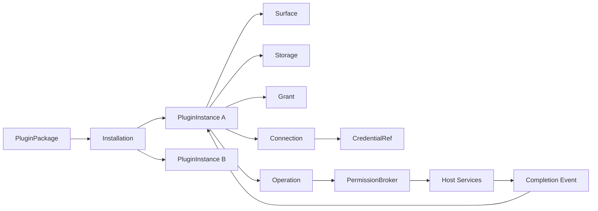

# Floatile 插件平台长期演进路线

> 状态：Accepted（规划基线，不冻结具体 API）
>
> 范围：Plugin Platform V1+
>
> 基线：2026-08-26
>
> 关联事实源：`requirements.md`、`../plugin-sdk/plugin-system-architecture.md`、
> `../security/permission-model.md`、`../security/http-broker.md`

## 1. 文档目的

本文定义 Floatile 从 P0 技术原型演进为开发者插件平台的长期方向、领域模型、里程碑依赖和接手
协议。它回答“平台最终要让插件做到什么”以及“后续 PR 应按什么顺序补齐底座”，不替代 P0
需求和验收标准，也不把规划能力表述为已经实现。

本文中的平台方向和边界是后续工作的规划事实源；WIT、持久化格式、包格式、安全策略等不可逆
细节仍必须通过对应规范、契约测试和 ADR 决策。里程碑状态只在获得代码、测试或验证证据后更新。

## 2. 平台北极星

Floatile 是一个**安全、可组合、语言中立的桌面插件平台**。浮窗是平台提供给插件的核心呈现
Surface，而不是平台能力的全部边界。平台应让开发者用稳定的领域模型构建长期运行的桌面工具，
让宿主统一承担权限、凭证、异步任务、资源预算、持久化、窗口和分发责任。

插件作者面对的最小心智模型保持为：

```text
State + View + Event + Context
```

宿主内部负责管理：

```text
Package + Installation + Instance + Connection + Operation
        + Grant + Storage + Surface
```

“插件能力尽量强大”不等于“插件获得任意系统访问”。真正可持续的强大来自足够丰富、可组合、
可版本化、可审计且有明确失败语义的宿主能力。开发者不应通过原始 WASI 网络、文件、环境变量、
进程、动态库或原生窗口句柄绕过宿主。

## 3. 平台原则

| ID | 原则 | 对设计和实现的约束 |
|---|---|---|
| PP-G1 | 能力优先，而非特例优先 | 新需求先抽象为可复用 capability；不得为某个 AI、日历或 CI 供应商增加专用宿主 API。 |
| PP-G2 | 宿主拥有敏感资源 | 凭证、连接、窗口、后台任务和系统资源由宿主管理；guest 只持有不可伪造的引用或收到裁剪后的数据。 |
| PP-G3 | 默认拒绝且持续授权 | 所有宿主能力必须经过 `PermissionBroker`；授权不仅在安装时检查，也必须在执行、恢复和权限撤销后重新检查。 |
| PP-G4 | 契约单源且类型化 | `wit/` 是 host/guest API 唯一来源；capability、UI schema 和 SDK 由各自单源生成，不用通用 JSON-RPC 逃避版本契约。 |
| PP-G5 | 异步工作由宿主托管 | 网络、同步、长计算等不得阻塞 Slint 主线程或插件 actor；操作必须可超时、取消、限流、审计并处理迟到结果。 |
| PP-G6 | 实例隔离优先 | 同一插件可以有多个独立实例；配置、状态、存储、配额、操作和故障不得错误串到其他实例。 |
| PP-G7 | 环境差异显式化 | 能力由运行时探测和 grant 决定；插件可以获得明确的 unavailable/degraded 结果，不根据 OS 名称猜测。 |
| PP-G8 | 渐进增强 | 基础功能在较少能力下仍可工作；网络、通知、后台刷新或高级 UI 不可用时必须有可观察的降级路径。 |
| PP-G9 | 作者工具即平台 API | CLI、诊断、测试夹具和稳定 `--json` 输出是平台的一部分；不能要求作者理解 Wasmtime、Slint 或内部包结构。 |
| PP-G10 | 证据驱动演进 | 完成状态来自契约测试、失败路径和运行证据；示例插件用于暴露通用框架缺口，不用于绕过平台边界。 |

## 4. 核心领域模型

领域模型必须先于网络、市场或供应商适配稳定下来。否则每增加一种能力都会把“包、窗口、账户、
运行任务”继续混在一起，使权限、重试和多实例语义无法收敛。

| 概念 | 所有者 | 语义与边界 |
|---|---|---|
| `PluginPackage` | 构建/分发 | 不可变的版本化 `.floatile` 产物，包含 manifest、WASM、UI IR 和 assets。 |
| `Installation` | 宿主 | 一份已安装包，记录来源、内容 digest、版本、信任状态和可回滚信息；不等同于运行实例。 |
| `PluginInstance` | 宿主 | 用户配置并运行的一个 Widget 实例。同一 Installation 可以创建多个实例，各自有生命周期和隔离边界。 |
| `Connection` | 宿主 | 一个外部账户或数据源连接，包含 provider、account identity、credential reference 和健康状态；经 grant 后可被一个或多个实例引用。 |
| `CredentialRef` | 宿主 | 指向安全凭证存储的不透明引用。guest 不读取、枚举、记录或持久化明文 secret。 |
| `Config` | 宿主/插件契约 | 经 schema 校验的非敏感用户设置；版本升级必须有迁移或明确失败策略。 |
| `State` | 插件运行时 | 驱动 UI 的权威、易失运行状态；默认不承担长期持久化责任。 |
| `Storage` | 宿主 | 按实例或插件隔离的持久数据；有 schema/配额/迁移/事务和故障语义。 |
| `Grant` | Permission Broker | 某主体在明确 scope、环境、期限和配额内使用 capability 的授权。 |
| `Operation` | 宿主 | 一次可能跨越插件回调的异步工作，拥有 ID、deadline、generation、取消状态、审计和唯一终态。 |
| `Surface` | 宿主 | 窗口、画布或其他呈现容器；插件声明 View 和意图，宿主拥有真实窗口与平台句柄。 |
| `Event` | Runtime | 外部结果、用户输入和生命周期进入插件的唯一入口；必须经过 schema、大小和队列预算校验。 |

### 4.1 关键关系



一个实例停止或被删除时，不得隐式删除仍被其他实例引用的 Connection；一个 Connection 被撤权时，
相关新操作必须立即拒绝，进行中操作必须按 capability 的撤销策略取消或丢弃结果。Operation 的完成
事件只能投递给发起它的实例 generation，避免实例重启后接收旧结果。

## 5. 能力与执行模型

### 5.1 Capability Registry 单一事实源

每项宿主能力至少声明以下元数据，并由同一注册表生成或校验 manifest、Broker、文档、SDK 表面和
契约测试：

- 稳定 capability ID、版本和风险等级；
- sync/async/stream 等执行种类；
- 参数、结果与错误 schema；
- grant 主体、scope、环境限制和默认拒绝规则；
- 并发、频率、结果大小、存储或带宽配额；
- timeout、cancellation、retry 和 idempotency 语义；
- 审计字段与敏感数据脱敏规则；
- SDK 映射、最小宿主版本和降级结果。

通用能力应围绕 `clock`、`timer`、`storage`、`metrics`、`theme`、`http`、`connection`、
`notification`、`clipboard`、`file-picker` 等可复用边界演进。是否开放某项能力取决于风险建模和
Broker 实现，不以某个参考插件急需为理由绕过注册表。

### 5.2 长任务采用宿主 Operation

当前串行实例 actor 和单次调用墙钟预算不适合把网络请求直接做成阻塞式 guest import。ADR-0004
及宿主 spike 已比较：

1. 同步 WIT import；
2. 宿主后台任务 + operation ID + completion event；
3. Component Model async/future（若当时工具链已具备可维护性）。

采用第 2 种：插件回调提交请求并获得 `operation-id` 后立即返回；宿主重新授权、执行和限流；只含
元数据的有界 completion signal 回到原实例，插件再通过 capability-specific typed `take-result`
一次性领取结果并更新 State。宿主模型已由 reference fixture 验证；v1.1 已通过 WIT 唯一源、Rust SDK
和真实 guest contract test 落地首个 `storage:read` typed adapter。后续 capability 仍不得绕开该模型。

Operation 基础设施必须统一处理：

- deadline、主动取消、实例 stop/suspend/delete；
- 权限撤销、Connection 更新和凭证轮换；
- generation 校验、迟到结果、重复完成和宿主重启；
- 每实例队列、并发数、payload 大小和全局资源上限；
- retry/backoff、幂等键和 provider rate limit；
- 错误分类、指标、trace 关联和审计脱敏。

## 6. 目标作者闭环

平台 V1 的最小可信作者闭环是：

```text
new → dev → test → preview → build → install → run → inspect
```

每一步必须既适合人，也适合 Agent：交互输出可读，自动化输出使用稳定 `--json` schema 和明确
exit code。生成项目必须只依赖可获得的 SDK，并能从干净目录构建；`dev/preview` 必须运行真实宿主
契约，而不是使用另一套模拟语义；`test` 必须能注入事件、能力结果、拒绝、超时和取消；`inspect`
必须显示 manifest、契约版本、权限、资源预算和兼容性诊断。

语言扩展遵守“同一契约、同一 vectors、同一失败语义”。先把 Rust 闭环做成可持续基线，再接入
具备可维护 Component Model 工具链的 TypeScript 或其他语言；不得为了语言数量复制 runtime 语义。

## 7. 长期里程碑

里程碑编号是长期稳定引用。后续 issue、PR、commit body 和 Agent handoff 应使用 `PP-Mx`，避免
引用会移动的段落。顺序表达依赖关系，不要求一个里程碑的所有增强都完成后才能研究下一阶段，但
进入后续生产实现前必须满足表中的退出门。

| ID | 里程碑 | 状态 | 主要交付 | 退出门 | 主要影响 |
|---|---|---|---|---|---|
| PP-M0 | 战略与事实源基线 | 进行中 | 本路线、P0 范围关系、稳定引用和 Agent 接手协议 | 事实源互链；不存在把规划写成已实现的表述 | `docs/` |
| PP-M1 | 插件内核与真实多实例 | 已完成（Xvfb 验证） | Package/Installation/Instance 分离；实例 CRUD、生命周期、持久化和故障隔离 | 同包多实例可独立配置、启动、停止、恢复和删除；迁移及失败测试通过 | `core`、`store`、`runtime`、`shell`、CLI |
| PP-M2 | Broker 化异步 Operation | 已完成（自动化契约验证） | ADR-0004；operation registry、队列、取消、deadline、generation、v1.1 WIT/SDK、元数据 completion 与首个 `storage:read` typed adapter | reference fixture 覆盖成功、拒绝、超时、取消、迟到结果、实例重启和过载；host/guest contract vectors 通过 | `core`、`runtime`、`services`、WIT、SDK |
| PP-M3 | Capability Registry 单源 | 已完成（自动化契约验证） | 统一 capability 元数据，生成/校验 manifest、Broker、SDK 映射与 contract vectors | 注册表/WIT/manifest/CLI/Broker 动态覆盖测试；恶意插件和配额测试证明默认拒绝 | `core`、`services`、plugin API、SDK、CLI |
| PP-M4 | Rust 作者闭环 | 规划中 | 可发布方式待许可决定的 SDK 解析、生成模板修复、dev/test/preview/build/install/run/inspect | 干净目录中的示例插件无需仓库私有路径即可完成全流程；JSON 契约有测试 | SDK、CLI、runtime、shell、docs |
| PP-M5 | 外部数据平台 | 规划中 | Connection、Credential Vault、HTTPS Broker、调度、缓存、重试、限流和连接健康状态 | AI 余额参考插件只使用通用能力，且 secret 不进入 guest、日志、State 或包 | `core`、`store`、`services`、shell、WIT、SDK |
| PP-M6 | UI 平台 | 规划中 | loading/empty/error、列表/网格、badge、progress、sparkline/chart、主题与响应式布局 | 参考插件无需第三方 Slint/HTML 即可表达监控型 UI；预算和无障碍语义有契约 | UI schema、renderer、SDK、shell |
| PP-M7 | SDK 与语言生态 | 规划中 | Rust API 稳定化；在工具链可行后接入 TypeScript；生成文档、迁移指南和 conformance kit | 双语言通过相同 contract vectors、恶意输入和端到端示例；不存在宿主语义分叉 | SDK、plugin API、CLI、CI |
| PP-M8 | 分发与信任 | 规划中 | publisher/signing、来源与信任、权限 diff、兼容性解析、更新/回滚和可恢复安装 | 安装与升级能解释权限变化和失败原因；篡改/降级/回滚路径有测试 | CLI、core、store、shell、distribution |
| PP-M9 | 组合与自动化 | 规划中 | 宿主事件、定时/系统触发、受控 pub/sub、工作流和通知 | 插件间不直接持有句柄；事件有 schema、scope、背压、循环检测和审计 | core、runtime、services、WIT、SDK |
| PP-M10 | 产品化与发布门禁 | 规划中 | 跨平台交互证据、性能、许可、安装器、更新器、无障碍、崩溃恢复和运维诊断 | 产品目标平台通过发布矩阵；许可 ADR 和分发门禁完成；关键 SLO 有实测证据 | 全仓库 |

### 7.1 当前基线与最近顺序

截至 2026-08-26，仓库已具备统一 UI IR、WIT 形状、Wasmtime actor、基础 capability 类型与 Broker、
部分宿主服务、Rust SDK、包校验/安装和第三方运行时窗口等基础。PP-M1 已打通自动化的
持久多实例生命周期：`floatile instance` 提供创建、枚举、读取、配置、启停和删除；
CLI 与 shell 共用安装目录 digest/身份/Config schema 复验；shell 后台监督器在不阻塞 Slint
主线程的前提下动态对齐 desired state、推进 generation，并独立启停同包的多个窗口。
单实例安装缺失、篡改、配置非法或 UI/runtime 失败不会阻止同行实例。shell 控制面已提供安装/实例列表、
Config Schema 表单、observed 状态和手动 retry；Linux X11/Xvfb 已自动验证同包双窗口、失败隔离与恢复。
但仓库还不是完整的插件作者平台：

- Windows、macOS、Wayland 与真实 Linux 桌面的控制面交互和动态多窗口仍缺实测；
- 生成项目和 `dev` 流程尚不能证明仓库外作者可完成预览到运行闭环；
- Broker 化 Operation 已通过 v1.1 WIT/SDK 暴露通用 cancel、元数据 completion 与首个
  `storage:read` typed submit/take；更多 capability adapter、动态撤权与真实容量数据仍待后续切片；
- PP-M3 已由 `floatile-core` 的机器可读 Capability Registry 统一稳定名称、暴露方式、参数族、风险、
  执行形态、WIT/SDK/CLI 与审计映射；manifest schema、CLI 和 Broker 已消费注册表并有 drift 测试；
- PP-M4 已完成 `inspect` 与 `check` 纵向切片：包检查输出版本化 manifest/版本轴/权限/预算/entry digest；
  项目检查在自动清理的临时目录复用正式构建/校验链并输出五阶段稳定 JSON。代码能力使用静态分析、
  真实窗口 `dev/preview`、其余命令统一诊断和仓库外 SDK 获取仍待后续切片；
- 网络、Connection 与凭证托管尚未成为可用契约；
- TypeScript runtime 的 ADR-0003 spike 结论是 no-go，不能把语言目标标记为完成；
- 设置、连接管理、权限解释和开发诊断还没有完整产品入口。

因此最近的 PR 顺序应优先建设通用底座：

1. `docs(core): define plugin platform v1 domain model and roadmap`（PP-M0，已落地）；
2. `feat(instances): introduce persistent plugin instance model`（PP-M1，已落地）；
3. `feat(shell): launch and isolate persistent plugin instances`（PP-M1，已落地）；
4. `feat(instances): complete dynamic persistent instance lifecycle`（PP-M1，已落地）；
5. `feat(shell): add instance control surface and lifecycle evidence`（PP-M1，已落地）：集中交付安装/实例列表、
   observed starting/running/failed/stopped 状态、手动 retry、Config schema 表单和 Xvfb 动态双窗口恢复证据；
6. `spike(runtime): validate brokered async operations`（PP-M2，本切片）：ADR-0004、宿主 Operation
   registry、Broker 单一入口、有界 completion bridge 与 reference failure vectors；正式 WIT 不变；
7. `feat(runtime): expose typed brokered operations through WIT`（PP-M2，本切片）：从 `wit/` 单源增加
   operation ID/cancel/completion metadata 与首个 `storage:read` typed submit/take，联动 Rust SDK、
   plugin API、runtime actor 和 host/guest contract fixture；
8. `refactor(capabilities): establish single-source capability registry`（PP-M3，已落地）；
9. `feat(cli): complete the Rust plugin author loop`（PP-M4）；
10. `feat(connections): add host-owned connection and credential references`（PP-M5）；
11. `feat(http): implement the first bounded HTTPS Broker vertical slice`（PP-M5）；
12. `feat(examples): add an AI balance monitor reference plugin`（PP-M5/PP-M6）。

这是依赖顺序，不是要求一个 PR 同时完成整个里程碑。每个 PR 必须是一条可审查、可回退、包含失败
路径和联动文档的纵向切片。

## 8. 参考插件策略

参考插件是平台契约的验收消费者，而不是一次性 demo。每个参考插件应验证不同的通用能力轴：

| 参考插件 | 主要验证内容 |
|---|---|
| Clock | 生命周期、timer、State 投影和最小 UI |
| Countdown | 用户 Event、配置、实例持久化和恢复 |
| System Monitor | 高频 metrics、采样节流、图表和资源预算 |
| AI Balance Monitor | Connection、CredentialRef、HTTPS、后台刷新、缓存、错误恢复和权限解释 |
| CI Monitor | 列表/分页、状态映射、通知和 provider rate limit |
| Calendar | 认证连接、增量同步、时区、后台调度和离线状态 |

AI 余额监控不应促使宿主增加 `openai_balance()` 或某家供应商专用接口。插件通过通用 HTTPS、
Connection、凭证注入、调度、缓存和 UI 组件完成适配；新增供应商通常只需插件代码和配置 schema。
若参考插件无法实现，应先记录暴露的通用平台缺口，再在相应里程碑修复。

## 9. 当前阶段的验证取舍

当前开发条件不足以持续获得 Windows、macOS、X11 和 Wayland 的完整人工交互证据。PP-M1 至
PP-M9 可以把单一参考开发环境（当前 Linux/X11/Xvfb）作为框架迭代主环境，以缩短领域模型、契约和
作者体验的反馈周期。

这项取舍只调整优先级，不改变以下约束：

- 不删除或伪造已经定义的 P0 跨平台需求、平台矩阵和历史证据；未验证仍明确写“未验证”；
- OS API、窗口分支和 `unsafe` 继续只存在于 `floatile-platform`，上层继续消费 runtime probe；
- CI 中可承担的跨平台构建和纯逻辑测试继续保持；修改平台行为的 PR 仍必须做相称验证；
- 完整实机交互、性能和发布矩阵集中在 PP-M10，或在具备测试条件时提前补证据；
- 许可仍是任何对外分发的硬门禁，但不阻塞仓库内的平台模型和契约设计。

同样，TypeScript、签名/市场、自动更新和跨平台人工验证是**延后**而非删除。任何 PR 都不得用本节
作为放宽安全、可移植性或分发门禁的依据。

## 10. 架构红线

后续演进不得：

- 为单一服务商创建宿主专用 API，或把 provider secret 传入 guest；
- 向 guest 开放 ambient 网络、文件系统、环境变量、命令、动态库或原生窗口句柄；
- 用无类型通用 JSON-RPC/capability bus 取代版本化 WIT 和 schema；
- 允许插件直接提供第三方 `.slint`、HTML/WebView 或任意原生 UI 来绕过 UI IR；
- 在 Slint 主线程阻塞 I/O、等待 Tokio 或同步执行不受信任 WASM；
- 让 TypeScript 或其他 SDK 复制并逐渐偏离 Rust/host 契约语义；
- 在 Installation、Instance、兼容性、更新与回滚模型完成前把 marketplace 当作近期目标；
- 以“参考插件能跑”为由跳过权限拒绝、配额、审计脱敏、故障隔离和恶意输入测试。

## 11. 后续 Agent 执行与接手协议

处理插件平台工作时，Agent 必须按以下顺序执行：

1. 读取 `CONTRIBUTING.md`、`docs/README.md`、本文和目标领域的事实源；
2. 用一个或多个稳定 ID（如 PP-M2、PP-G5）定义本次 PR 的目标和明确非目标；
3. 检查 branch、status 和 diff，从最新 `dev` 的独立 `agent/<topic>` 分支工作，并避让已有修改；
4. 标出受影响的领域概念、crate、WIT/UI/capability/持久化联动和安全失败路径；
5. 对不可逆 API、线程模型、安全、存储或包格式决策先新增 ADR 或完成有结论的 spike；
6. 实现最小纵向切片，同时覆盖成功、拒绝、超时/取消（适用时）、资源上限和宿主存活；
7. 运行与风险相称的验证，只用实际证据更新实现状态、平台矩阵或本路线；
8. 交付时记录 `Refs`、`Tests`、`Unverified`、剩余风险和建议的下一条切片。

每次接手至少留下以下信息，写入 PR 描述、commit body 或任务交付说明；不需要为每个 PR 新建进度
文档：

```text
Milestone: PP-Mx
Principles: PP-Gx, ...
Delivered: 本次真实完成的纵向切片
Tests: 实际执行的命令与结果
Unverified: 未覆盖的平台、交互、性能或故障路径
Risks/decisions: 新风险、ADR 或临时限制
Next slice: 一个可独立审查的后续目标
```

只有里程碑退出门获得相应证据时才能把状态改为“已完成”。部分代码、stub、示例 mock 或仅能编译
不得作为完成依据。路线变化应修改本文；契约和实现变化还必须同步各自事实源，不能只改路线表。
